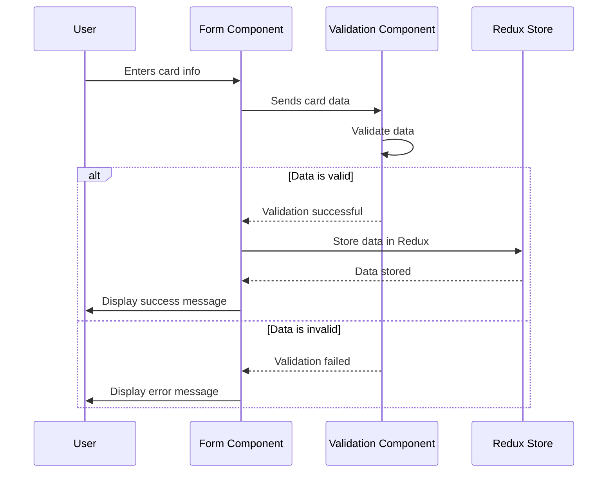

# Credit Card Validation App

This project is a front-end application built using React.js and Tailwind CSS that allows users to submit credit card details for validation. The application checks the specified country against a list of banned countries, stores valid cards for the session using redux store, and displays captured credit cards during the session.

## Requirements

The Credit Card Validation App fulfills the following requirements:

- Allow users to submit credit card details, including the country it is from.
- Validate the specified country against a list of banned countries.
- Store valid credit cards for the session.
- Display captured credit cards during the session.
- Prevent capturing the same card twice.

## Features

- User-friendly form interface for entering credit card details.
- Validation of credit card number format.
- Dropdown to select the country of the credit card.
- Validation of the specified country against banned countries.
- Prevents duplicate submission of the same credit card.
- Responsive design for various screen sizes.
- Neatly displays captured valid credit cards.

## Sequence Diagram



## Getting Started

1. Clone the repository:

```bash
https://github.com/TheCatalysts/react-secure-card-capture.git
```

2. Navigate to the project directory:

```bash
cd credit-card-validation-app
```

3. Install the required dependencies:

```bash
npm install
```

4. Start the development server:

```bash
npm start
```

5. Open your web browser and navigate to `http://localhost:3000` to access the application.

## Technologies Used

- React.js: A JavaScript library for building user interfaces.
- Tailwind CSS: A utility-first CSS framework for rapid UI development.
- ReactRedux: a state management library for managing application state and store information for a session.

## Contributions

Contributions are welcome! If you find any issues or want to enhance the application, feel free to submit a pull request. Alternatively you can reach out to me on the contact details below.

## Contact

If you have any questions or need further assistance, please feel free to contact me :

<p align="left">
</p>

<p align="left">
  
  <b>:</b> sthelonombusor@gmail.com
</p>

<p align="left">
  
  <b>:</b> (https://github.com/TheCatalysts/)
</p>

## License

This project is licensed under the [MIT License](https://opensource.org/licenses/MIT).
